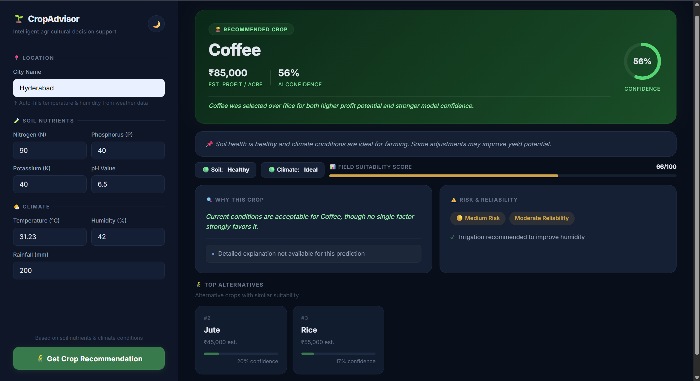

## Problem

Farmers often rely on generic recommendations without considering real-time soil and climate conditions, leading to suboptimal crop choices and reduced profitability.

## Solution

This system provides AI-driven crop recommendations using soil nutrients and environmental conditions, enhanced with explainability, risk analysis, and profit-based decision making.

## Key Features

- AI-powered crop prediction using machine learning
- SHAP-based explainability with human-readable insights
- Profit estimation and decision-based ranking
- Risk analysis and reliability scoring
- Real-time weather integration
- Interactive dashboard with modern UI

# Smart Crop Advisory System

An AI-powered web application that recommends the most suitable crop based on soil conditions, weather data, and economic factors, along with actionable farming advice.

---

## Features

- Crop recommendation using machine learning  
- Real-time weather integration  
- Profit estimation for each crop  
- Confidence and risk analysis  
- Decision engine for best crop selection  
- Actionable farming recommendations  
- Interactive user interface  

---

## How It Works

1. User inputs soil and environmental data (or provides a city for weather data)
2. System fetches real-time weather information
3. ML model predicts the top 3 suitable crops
4. A decision engine selects the best crop based on profit and confidence
5. The system provides:
   - Profit estimation  
   - Confidence score  
   - Risk level  
   - Practical recommendations  

---

## Tech Stack

- Backend: Python, Flask  
- Machine Learning: Scikit-learn  
- Frontend: HTML, CSS, JavaScript  
- API: OpenWeatherMap  

---

## Preview

### Dashboard

  

### Input Form

  

### Analysis & Risk

  

---

## Installation

git clone https://github.com/Azeem10101/Smart-Crop-Advisory-System.git  
cd Smart-Crop-Advisory-System  
pip install -r requirements.txt  
python app.py  

---

## Environment Variables

Create a `.env` file in the root directory and add:

WEATHER_API_KEY=your_api_key_here  

Do not share your API key publicly.

---

## API Endpoints

### /predict

{
  "features": [N, P, K, temperature, humidity, pH, rainfall]
}

### /get_weather

{
  "city": "Hyderabad"
}

---

## Key Highlights

- Moves beyond prediction to provide decision and advisory support  
- Integrates real-world weather data  
- Combines machine learning with economic analysis  
- Designed as a practical agricultural support tool  

---

## Future Improvements

- Automatic location detection  
- Yield prediction  
- Data visualization dashboard  
- Conversational interface  

---

## Author

Mohammed Abdul Azeem Arshad  
Computer Science Student  

---

## License

This project is open-source and available under the MIT License.